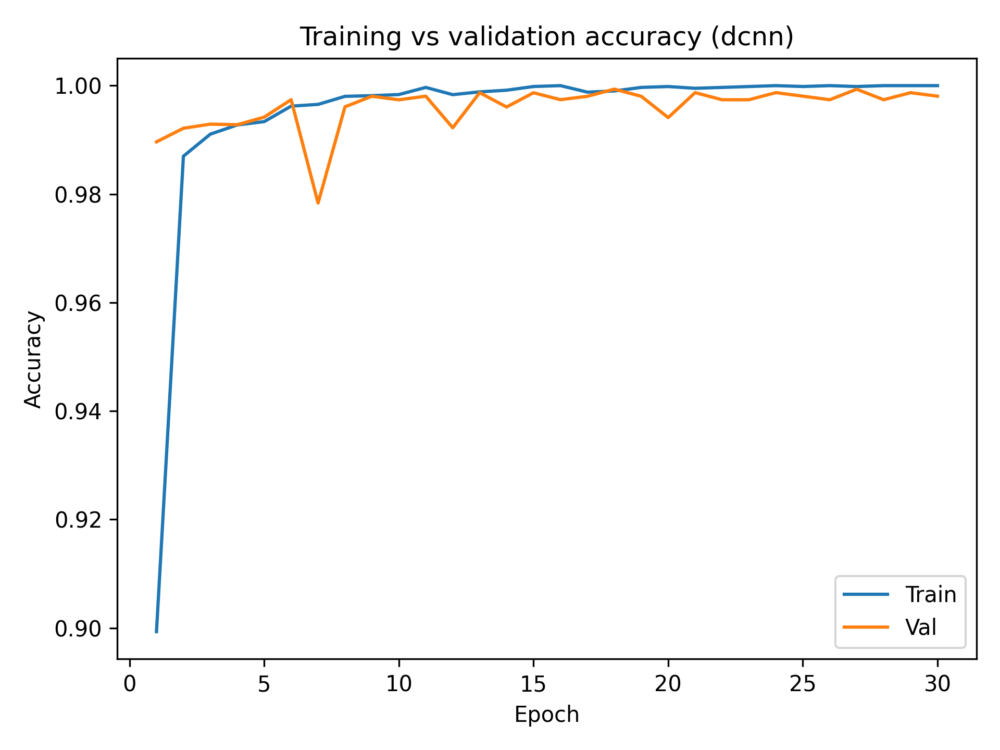
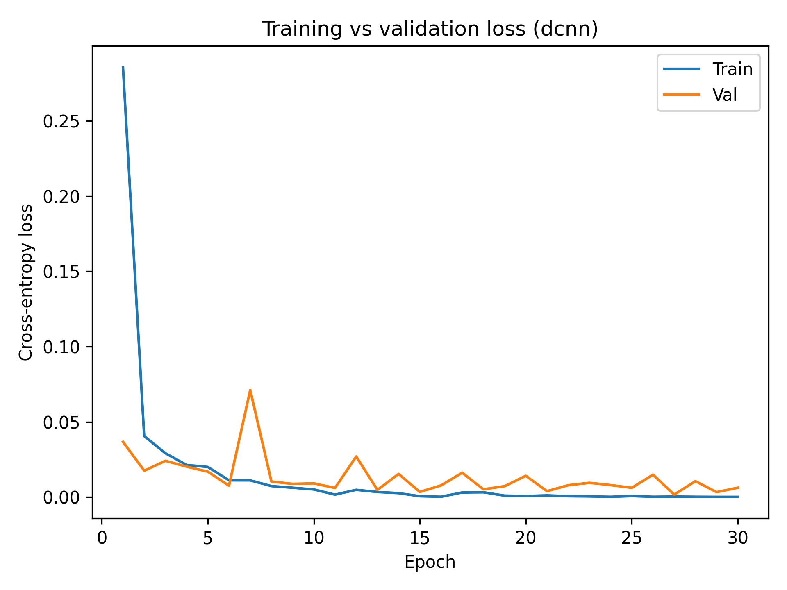
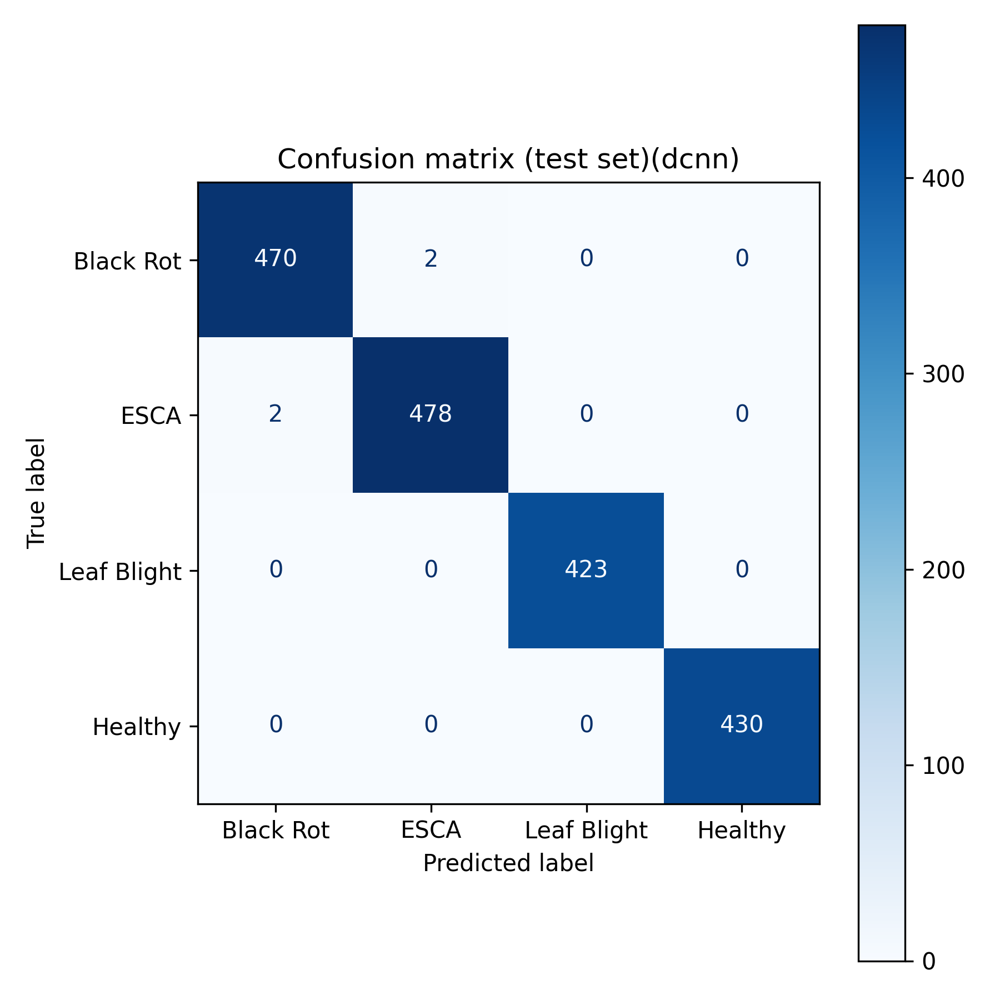

# DNN for Grapevine Disease Dataset

A pytorch version of DCNN with Grapevine Disease Dataset. 

For the model building, please refer to the paper: [Multiclass classification of diseased grape leaf identification using DCNN (Kerehalli Vinayaka Prasad, etc.)](https://www.nature.com/articles/s41598-024-59562-x).

## Download the Dataset

```python
import kagglehub

# Download latest version
path = kagglehub.dataset_download("rm1000/grape-disease-dataset-original")

print("Path to dataset files:", path)
```

## How to run or reproduce the results

```shell
# Train a simple baseline CNN without augmentation:
$ python train.py --data-root ./datasets/grape_disease_original --model simple_cnn --epochs 30

# Train a CNN  + augmentation:
$ python train.py --data-root ./datasets/grape_disease_original --model cnn_aug --epochs 30 --augment

# Train the VGG16‑based DCNN with augmentation:
$ python train.py --data-root ./datasets/grape_disease_original --model dcnn --epochs 30 --augment
```

## Results

| **Model**  | **Accuracy** | **Precision** | **Recall** | **F1 Score** |
|:---        | :---         | :---          | :---       | :---         |
| Simple CNN | 0.9846       | 0.9843        | 0.9846     | 0.9845       |
| CNN+Aug    | 0.9958       | 0.9958        | 0.9958     | 0.9958       |
| DCNN       | 0.9979       | 0.9979        | 0.9979     | 0.9979       |

## DCNN Training Details

### Accuracy and Loss with Augmentation





### Confusion Matrix


