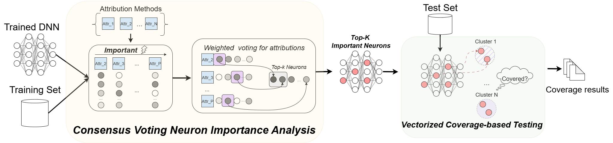

# WISDOM Package

A package for WISDOM, a white-box and semantically informed coverage testing tool for Deep Neural Networks with xAI methods.

<!--  -->
<div align="center">
  
</div>

## Prerequest

Use `conda` or `pyvenv` to build a virtual environment.

```shell
# requriements
$ pip -r install requirements.txt

# If you are using anaconda or miniconda virtual environment, do:
$ conda env create -f requirements_venv.yaml
```

## Install wheel package

```shell
$ git clone https://github.com/JoshuaQSH/Wisdom.git
$ cd Wisdom/dist
$ pip install wisdom-0.1.0-py3-none-any.whl
```

## Using `uv`

We will provide a package later on, but now you could use `uv pip install` just like `pip install` to get the lib.

```shell
$ uv venv wisdom --python 3.12
$ source .venv/bin/activate
$ uv pip install wisdom-0.1.0-py3-none-any.whl
```

Or

```shell
$ uv pip install wisdom
```

with the `pyproject.toml`.


## Uninstall wheel package

```shell
$ pip uninstall wisdom
```

## Install changes in the library

In case of changes in the source code of the library, then the wheel package needs to be recreated. Please follow the steps below for receating the wheel package.

```shell
$ cd Wisdom/
$ python setup.py bdist_wheel
```

Once this is done, a Wisdom/dist directory will be created. Then follow the instractions in the installation section.


## Directories and files

- `build`: Lib build file
- `wisdom`
    - `attribution`: Main attribution methods definition and a customized template
    - `clustering`: Clustering methods and WISDOM assignments
    - `core`: Core files of WISDOM
    - `pruning`: Pruning methods (mask and weight pruning)
    - `utils`: Helper and common files
- `coverage_methods`: Some basline coverage-based methods
- `dist`: Wheels
- `Docker`: Docker file [WiP]
- `saved_files`: Saved files, including the neuron importance scores in CSV
- `config.py`
- `requirements_venv.yaml`
- `requirements.txt`
- `pyproject.toml`
- `setup.py`
- `run_wisdom.py`

## Run Wisdom

```shell
$ python3 run_wisdom.py \ 
    --impl wisdom \
    --model-name lenet \
    --dataset cifar10 \
    --data-path /path/to/datasets \
    --device cuda:0 \
    --top-m-neurons 10 \
    --batch-size 64 \
    --end2end \
    --all-class \
    --csv-file ./saved_files/pre_csv/lenet_cifar10.csv \
    --model-path ./models_info/saved_models/lenet_CIFAR10_whole.pth
```

## Docker

See `Docker` with the `Dockerfile`
