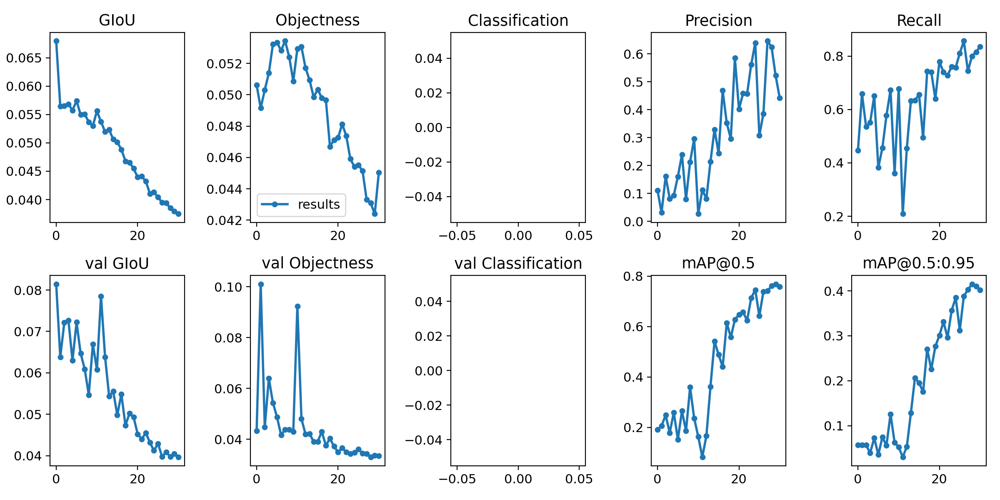
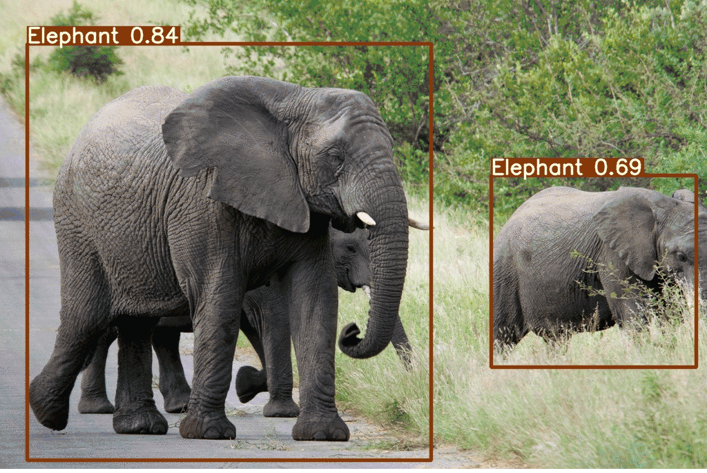

# YOLOv5 Analysis

## Licence
[](https://www.gnu.org/licenses/gpl-3.0)

This repository is forked from [Mihir Rajput](https://github.com/mihir135), I only did a small changes for the model and the dataset to fit the latest `torch` and `numpy`, please refer to the origin [repository](https://github.com/mihir135/yolov5) for more details.

For the tutorial, please visit [here](https://pub.towardsai.net/yolo-v5-is-here-custom-object-detection-tutorial-with-yolo-v5-12666ee1774e).

## Model Training Matrix Example (elephant)


## Output Example (elephant)



## The YOLO format for annotations

Refer to [HERE](https://github.com/AlexeyAB/Yolo_mark/issues/60)

.txt-file for each .jpg-image-file - in the same directory and with the same name, but with .txt-extension, and put to file: object number and object coordinates on this image, for each object in new line: `<object-class> <x> <y> <width> <height>`

- `<object-class>` - integer number of object from 0 to (classes-1)
- `<x> <y> <width> <height>` - float values relative to width and height of image, it can be equal from (0.0 to 1.0]
- for example: `<x> = <absolute_x> / <image_width>` or `<height> = <absolute_height> / <image_height>`
- atention: `<x> <y>` - are center of rectangle (are not top-left corner)

`img1.txt` for `img1.jpg` would be like:
```txt
1 0.716797 0.395833 0.216406 0.147222
0 0.687109 0.379167 0.255469 0.158333
1 0.420312 0.395833 0.140625 0.166667
```

## How to run

- Need to change the path in the YAML file (e.g., `coco.yaml`)

```shell
# Download the dataset first [COCO2017]
wget https://github.com/ultralytics/assets/releases/download/v0.0.0/coco2017labels.zip
wget http://images.cocodataset.org/zips/train2017.zip
wget http://images.cocodataset.org/zips/val2017.zip
wget http://images.cocodataset.org/zips/test2017.zip

# Unzip and move all the dataset to the new dir under `data`, e.g., data/coco/images/train2017

# Training - with elephant dataset [PASS]
CUDA_VISIBLE_DEVICES=1 python train.py --img 640 --batch 8 --epochs 30 --data ./data/elephant.yaml --cfg ./models/yolov5s.yaml --weights '' --device 0

# Inference - with elephant dataset [PASS]
python detect.py --source ./data/image  --weights weights/best_s_elephant.pt --conf 0.4

# Training - with COCO
CUDA_VISIBLE_DEVICES=1 python train.py --img 640 --data ./data/coco.yaml --epochs 30 --batch 12 --cfg ./models/yolov5l.yaml --weights '' --device 0


# testing
python analysis_demo.py --img 640 --batch 8 --epochs 30 --data ./data/elephant.yaml --cfg ./models/yolov5s.yaml --weights '' --device 1
```

## Directory and files describtion

- `./data`: YAML files with both COCO dataset and a test class (elephant) dataset
- `./model`: Basic model files, including the yolo YAML
- `logs`: log files and the showcase files
- `./utils`: dataset and other basic settings
- `hubconf.py`: Accessing YOLOv5 models via PyTorch Hub

## COCO dataset

For one iter of the dataloader (3D):

D-1: `[batch_size, channel, width, height]`
D-2: `[ID, class, x_center, y_center, width, height]`


# How YOLO works

- Divide input image into an $S \times S$ grid of cells.
- In each cell $i$, predict $B$ bounding boxes (and confidences).
- For each box $j$ in cell $i$, predict: $(x_{ij}, y_{ij}, w_{ij}, h_{ij}, C_{ij}, p_{ij, 1}, p_{ij, 2} ... p_{ij, C})$, where:
    - $(x, y)$: box center relative to cell (offsets)
    - $(w, h)$: box width & height (normalized)
    - $C_{ij}$: confidence score that there is an object in this box
    - $p_{ij, k}$: conditional class probability (for class k), given object presence
    - The full output dimension is: $S \times S \times (B \times (5 + C))$

## Loss Function

The original YOLO (v1) loss is largely sum of squared errors (SSE) over the different prediction terms, with weighting factors. From the paper:

$L = L_{coord} + L_{size} + L_{obj} + L_{noobj} + L_{class}$

 - Bounding box localization error (center + size)
 - Confidence error for boxes that do have objects
 - Confidence penalty for boxes that have no object (to reduce false positives)
 - Classification error (only in cells that contain object)

Some changes overtime:
 
 - Replacing sum-of-squares with BCE / focal losses (for classification and objectness)
 - Using IoU / CIoU / GIoU / SIoU style losses for bounding box regression, which better align with overlap metrics
 - Decoupling the heads (separate branches) to avoid interference
 - Introducing task alignment losses or weighting so classification confidence correlates with localization quality

$L = \alpha_{box} L_{box} + \alpha_{obj} L_{obj} + \alpha_{cls} L_{cls}$

## Metrics

- Intersection over Union (IoU): overlap between predicted box and ground truth box
- Precision / Recall: counting true positives / false positives / false negatives under an IoU threshold
- Average Precision (AP), often mAP (mean AP across classes and/or IoU thresholds)
- Common thresholds: $IoU \ge 0.5$ (AP50), or more strictly, IoU varying from 0.5 to 0.95 (AP@[.5:.05:.95])

Intersection over Union (IoU) measures the overlap between a predicted bounding box and a ground truth bounding box. For one predicted box $B_P$ and one ground truth box $B_{gt}$:

$IoU(B_p, B_{gt}) = \frac{Area(B_P \cap B_{gt})}{Area(B_P \cup B_{gt})}$

$P = \frac{TP}{TP + FP}$

$R = \frac{TP}{TP + FN}$

$AP = \int_{0}^{1}P(R)dR $,
$AP = \sum_n(R_n -R_{n - 1})P_{interp}(R_n)$

where $P_{interp}(R_n) = max_{R' \ge R_n}(P(R'))$

Since object detection involves multiple classes, we take the mean of the APs over all classes:

$ mAP = \frac{1}{N_{class}}\sum_{c=1}^{N_{class}}AP_c$

So mAP@50 is

$mAP_{50} = \frac{1}{N_{class}}\sum_{c=1}^{N_{class}}AP_c(IoU=0.5)$

mAP@[.5:.95] (or mAP50–95) is to Compute AP at multiple IoU thresholds: {0.50,0.55,0.60,…,0.95} and average over all 10 thresholds:

$mAP_{50-95} = \frac{1}{10}\sum_{t=0.5}^{0.95}mAP_t$


- TP (True Positive): predicted box matches a ground truth box with IoU ≥ threshold (e.g., 0.5)
- FP (False Positive): predicted box does not match any ground truth (IoU < threshold or duplicate prediction)
- FN (False Negative): ground truth box not matched by any prediction

## Loss Components

- Class loss ($L_{cls}$): It is the loss associated with the error in the classification task. It uses Binary Cross Entropy (BCE) to support multi-label classification.
- Objectness loss ($L_{obj}$): It is the loss associated with the error in detecting the presence of an object in a particular grid cell. It also uses BCE.
- Bounding box loss ($L_{box}$): It is the loss associated with the bounding box prediction error. This is a regression task and, like YOLOv4, it uses the IoU loss (CIoU by default), which has been shown to perform better than MSE for this problem.

These losses are computed for each prediction layer and then summed up. Each loss component is weighted to control its contribution (tunable hyperparameters). Additionally, the objectness loss has an extra weight that varies for each prediction layer to ensure predictions at different scales contribute appropriately to the total loss. 


## Training pipeline

- Backbone / feature extractor $\rightarrow$ feature map
- Detection head, for each $(i,j)$ cell we get 8 outputs $\rightarrow$ $(x, y, w, h, C, p_{1}, p_{2}, p_{3})$, if we have 2 boxes per cell ($S = 4 \times 4$) and 3 classes. 
- Localization sub-loss: $\lambda_{coord} [(x - \hat{x})^2 + (y - \hat{y})^2] + \lambda_{coord}[(\sqrt{w} - \sqrt{\hat{w}})^2 + (\sqrt{h} - \sqrt{\hat{h}})^2]$
- Confidence (object): $(C_{ij} - C_{ij})^2$
- Confidence (no object), for all other cell-box pairs: $\lambda_{noobj} \sum(C_{others} - \hat{C}_{others})^2$ 
- Classification (for cell $i$ and class $k$): $(p_{i, c=k} - \hat{p}_{i, c=k})^2 + \sum_{c \neq k}(p_{i, c} - \hat{p}_{i, c})^2$

Backprop through the detection head layers $\rightarrow$ backbone $\rightarrow$ shared layers. Over many images, the model learns how to map features and accurate bounding boxes and class probabilities.


## Object Detection Metrics

- Intersection over Union (IoU): IoU is a measure that quantifies the overlap between a predicted bounding box and a ground truth bounding box. It plays a fundamental role in evaluating the accuracy of object localization.
- Average Precision (AP): AP computes the area under the precision-recall curve, providing a single value that encapsulates the model's precision and recall performance.
- Mean Average Precision (mAP): mAP extends the concept of AP by calculating the average AP values across multiple object classes. This is useful in multi-class object detection scenarios to provide a comprehensive evaluation of the model's performance.
- Precision and Recall: Precision quantifies the proportion of true positives among all positive predictions, assessing the model's capability to avoid false positives. On the other hand, Recall calculates the proportion of true positives among all actual positives, measuring the model's ability to detect all instances of a class.
- F1 Score: The F1 Score is the harmonic mean of precision and recall, providing a balanced assessment of a model's performance while considering both false positives and false negatives.

Precision is a metric evaluating the ability of a model to correctly predict positive instances. False positives are cases in which a machine learning model incorrectly labels as positive when they’re actually negative.
Precision = True Positives / (True Positives + False Positives)

Recall is a metric evaluating the ability of a machine learning model to correctly identify all of the actual positive instances within a data set. True positives are data points classified as positive by the model that are actually positive (correct), and false negatives are data points the model identifies as negative that are actually positive (incorrect).
Recall = True Positives / (True Positives + False Negatives)

## Non-Maximum Suppression (NMS)

Filtering the overlapping bounding boxes for a single object. It relies heavily on two key metrics: the confidence score, which indicates how certain the model is that a box contains an object, and the Intersection over Union (IoU), which measures the spatial overlap between two boxes.

- Thresholding: All candidate boxes with a confidence score below a specific threshold are immediately discarded to remove weak predictions.
- Sorting: The remaining boxes are sorted in descending order based on their confidence scores.
- Selection: The box with the highest score is selected as a valid detection.
- Suppression: The algorithm compares the selected box with all other remaining boxes. If the IoU between the selected box and another box exceeds a defined limit (e.g., 0.5), the lower-score box is suppressed (deleted) because it is assumed to represent the same object.
- Iteration: This process repeats for the next highest-scoring box until all candidates have been processed.

## Credits
https://ultralytics.com/ <br/>
https://roboflow.ai/ <br/>
https://github.com/mihir135/yolov5/tree/master?tab=readme-ov-file
