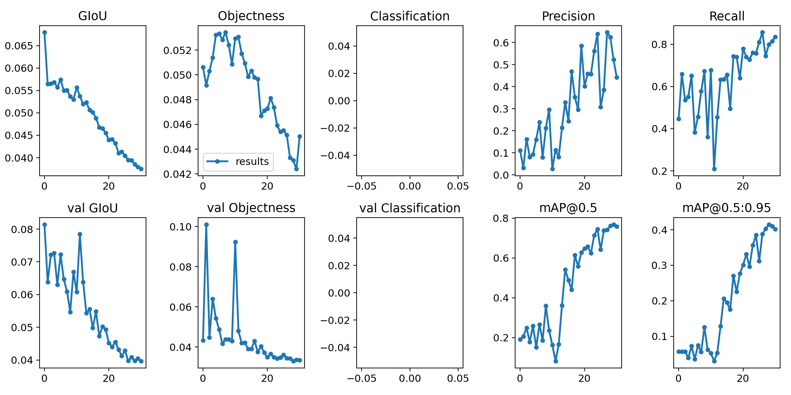
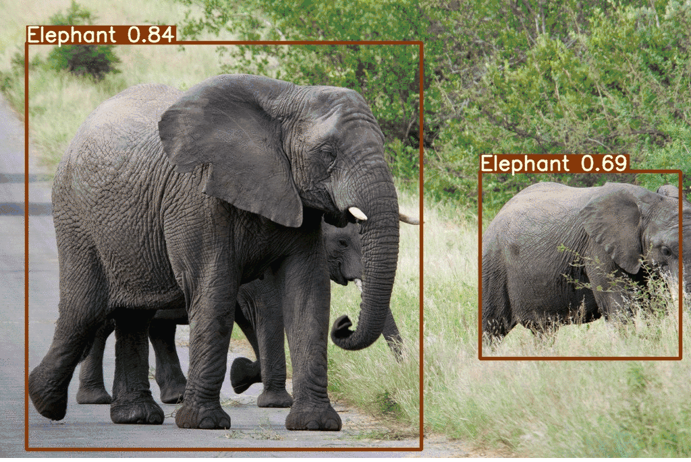

# YOLOv5 Analysis

## Licence
[](https://www.gnu.org/licenses/gpl-3.0)

This repository is forked from [Mihir Rajput](https://github.com/mihir135), I only did a small changes for the model and the dataset to fit the latest `torch` and `numpy`, please refer to the origin [repository](https://github.com/mihir135/yolov5) for more details.

For the tutorial, please visit [here](https://pub.towardsai.net/yolo-v5-is-here-custom-object-detection-tutorial-with-yolo-v5-12666ee1774e).

## Model Training Matrix Example (elephant)


## Output Example (elephant)



## The YOLO format for annotations

Refer to [HERE](https://github.com/AlexeyAB/Yolo_mark/issues/60)

.txt-file for each .jpg-image-file - in the same directory and with the same name, but with .txt-extension, and put to file: object number and object coordinates on this image, for each object in new line: <object-class> <x> <y> <width> <height>

- <object-class> - integer number of object from 0 to (classes-1)
- <x> <y> <width> <height> - float values relative to width and height of image, it can be equal from (0.0 to 1.0]
- for example: <x> = <absolute_x> / <image_width> or <height> = <absolute_height> / <image_height>
- atention: <x> <y> - are center of rectangle (are not top-left corner)

`img1.txt` for `img1.jpg` would be like:
```txt
1 0.716797 0.395833 0.216406 0.147222
0 0.687109 0.379167 0.255469 0.158333
1 0.420312 0.395833 0.140625 0.166667
```

## How to run

- Need to change the path in the YAML file (e.g., `coco.yaml`)

```shell
# Training - with elephant dataset [PASS]
CUDA_VISIBLE_DEVICES=1 python train.py --img 640 --batch 8 --epochs 30 --data ./data/elephant.yaml --cfg ./models/yolov5s.yaml --weights '' --device 0

# Inference - with elephant dataset [PASS]
python detect.py --source ./data/image  --weights weights/best_s_elephant.pt --conf 0.4

# Training - with COCO
CUDA_VISIBLE_DEVICES=1 python train.py --img 640 --data ./data/coco.yaml --epochs 30 --batch 12 --cfg ./models/yolov5l.yaml --weights '' --device 0
```

## Directory and files describtion

`data`: YAML files with both COCO dataset and a test class (elephant) dataset
`model`: Basic model files, including the yolo YAML
`logs`: log files and the showcase files
`utils`: dataset and other basic settings
`hubconf.py`: Accessing YOLOv5 models via PyTorch Hub

## Credits
https://ultralytics.com/ <br/>
https://roboflow.ai/ <br/>
https://github.com/mihir135/yolov5/tree/master?tab=readme-ov-file
